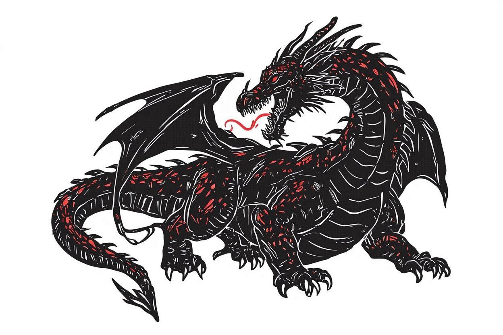

# Daredragon Fellowship

A cooperative card-based board game for 4–6 players.

*Author: Bartosz Sułkowski*

## Available language versions

- [English](README.md)
- [Polish](README_pl.md)

## Overview

A fellowship of heroes stands against a dreadful dragon. Players cooperate to defeat the dragon before it defeats them, using two standard card decks — one for the heroes' actions, one for the dragon's. The story is family-friendly, with the drama unfolding through cooperation and sacrifice rather than dark themes.

## Equipment

- 2 standard 54-card decks (including jokers), preferably in two different colours
- 8–10 distinguishable tokens (able to represent 2 states, e.g. meeples that can stand or lie)
- 2 additional tokens (turn tracker and attack target)
- Printed board and cheat sheet (see below)

## Files

### Rules

| File | Description |
|------|-------------|
| [rules/base_en.md](rules/base_en.md) | Rules |
| [rules/sample_gameplay_en.md](rules/sample_gameplay_en.md) | Sample gameplay |

### Printables

| File | Description |
|------|-------------|
| [board/base_en.pdf](board/base_en.pdf) | Board — base game |
| [board/extension_en.pdf](board/extension_en.pdf) | Board extension for 5–6 players |
| [board/cheat_sheet_en.pdf](board/cheat_sheet_en.pdf) | Cheat sheet |

### Design Notes

| File | Description |
|------|-------------|
| [design/decisions_en.md](design/decisions_en.md) | Internal notes on mechanics and design choices |

## Community

| Discussion | Description |
|---|---|
| [Helping Hand](https://github.com/bsulkowski/daredragon-fellowship/discussions/20) | Ask questions and clarify rules |
| [The Forge](https://github.com/bsulkowski/daredragon-fellowship/discussions/19) | Feedback on balance, improvements, and new ideas |
| [Tales from the Lair](https://github.com/bsulkowski/daredragon-fellowship/discussions/18) | Share your most epic moments from the game |
| [Most dreaded dragon's action](https://github.com/bsulkowski/daredragon-fellowship/discussions/17) | Poll |
| [Favourite character](https://github.com/bsulkowski/daredragon-fellowship/discussions/12) | Poll |

## Revision History

| Version | Date | Changes |
|---|---|---|
| 0.15 | 2026-04-11 | Added sample gameplay Streamlined entangle mechanic |
| 0.14.2 | 2026-03-27 | Filled and reorganized story commentary |
| 0.14.1 | 2026-03-18 | Added story commentary |
| 0.14 | 2026-03-16 | Added orchestrated attack mechanic. |
| 0.13.2 | 2026-03-16 | Instructions (EN) |
| 0.13 | 2025-02-05 | Redesigned shield and dodge mechanics Extended supported number of players |
| 0.12 | 2024-11-12 | Mechanics adjustment (target selection, modifiers) |
| 0.11.2 | 2024-11-11 | Downloadable board and cheat sheet |
| 0.11.1 | 2024-08-24 | Instructions — detailed description of game rules (PL) |
| 0.9 | 2023-12-29 | Designed the board |
| 0.7 | 2023-09-24 | Introduced the dracometer |
| 0.3 | 2023-06-18 | Introduced cooperative card drawing |
| 0.2 | 2022-10-08 | Detailed mechanics prototype |
| 0.1 | 2022-09-23 | Inception of design principles |

## License

See [LICENSE](LICENSE).
