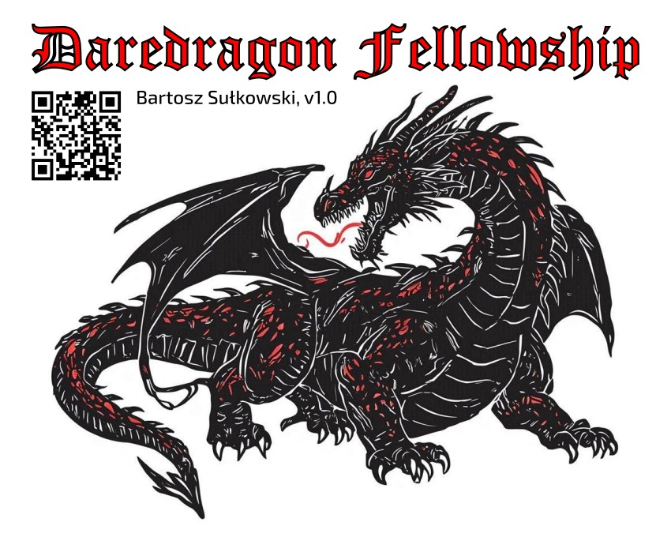

[English](README.md) / Polski

Kooperacyjna gra planszowa dla 4–6 graczy.

*Autor: Bartosz Sułkowski*

## Opis

Drużyna bohaterów staje naprzeciw groźnego smoka. Gracze współpracują, by pokonać smoka, zanim smok pokona ich — używając dwóch standardowych talii kart: jednej dla akcji bohaterów, drugiej dla akcji smoka. Historia jest bezpieczna dla całej rodziny — dramaturgia wyrasta ze współpracy i poświęcenia, nie z mrocznych motywów.

Zasady są niezależne od settingu — graj w świecie fantasy, science-fiction lub dowolnym, który wybierzesz.

Gra jest bezpłatna, open source i print-and-play — wszystko, czego potrzebujesz, znajdziesz w tym repozytorium.

## Zasady gry

| Plik | Opis |
|------|------|
| [rules/base_pl.md](rules/base_pl.md) | Zasady |
| [rules/sample_gameplay_pl.md](rules/sample_gameplay_pl.md) | Przykładowa rozgrywka |

## Materiały do druku

| Plik | Opis |
|------|------|
| [board/base_pl.pdf](board/base_pl.pdf) | Plansza dla 4 graczy |
| [board/extension_pl.pdf](board/extension_pl.pdf) | Rozszerzenie planszy dla 5–6 graczy |
| [board/cheat_sheet_pl.pdf](board/cheat_sheet_pl.pdf) | Ściągawka |

## Wyposażenie

- 2 standardowe talie po 54 karty (zawierające po 2 jokery), najlepiej w dwóch kolorach
- 8–10 rozróżnialnych pionków, mogących przedstawiać 2 stany (np. bierki szachowe lub inne ludziki, które mogą stać lub leżeć)
- 2 dodatkowe znaczniki (śledzenie tur i celu ataków)

## Uwagi projektowe

| Plik | Opis |
|------|------|
| [design/decisions_pl.md](design/decisions_pl.md) | Przemyślenia stojące za grą — dla graczy, osób prowadzących sesje i innych twórców. |

## Społeczność

| Dyskusja | Opis |
|---|---|
| [Helping Hand](https://github.com/bsulkowski/daredragon-fellowship/discussions/20) | Pytania i wyjaśnienia zasad |
| [The Forge](https://github.com/bsulkowski/daredragon-fellowship/discussions/19) | Opinie o balansie, pomysły na ulepszenia i nowe mechaniki |
| [Tales from the Lair](https://github.com/bsulkowski/daredragon-fellowship/discussions/18) | Podziel się najbardziej epicką chwilą z rozgrywki |

### Ankiety

- [Most dreaded dragon's action](https://github.com/bsulkowski/daredragon-fellowship/discussions/17)
- [Favourite character](https://github.com/bsulkowski/daredragon-fellowship/discussions/12)

## Linki zewnętrzne

- [BoardGameGeek](https://boardgamegeek.com/boardgame/469130/daredragon-fellowship)

### Inne gry autora

- [Bahama Taxi (2012)](https://github.com/bsulkowski/bahama-taxi)

## Historia wersji

| Wersja | Data | Zmiany |
|---|---|---|
| 1.0 | 2026-04-17 | Oficjalna promocja do wersji 1.0 |
| 0.15.1 | 2026-04-15 | Zdjęcia przykładowej rozgrywki |
| 0.15 | 2026-04-11 | Przykład rozgrywki Usprawniona mechanika oplątania |
| 0.14.2 | 2026-03-27 | Komentarz fabularny |
| 0.14 | 2026-03-16 | Mechanika skoordynowanego ataku |
| 0.13.2 | 2026-03-16 | Instrukcja (EN) |
| 0.13 | 2025-02-05 | Przebudowa mechaniki osłon i uników Rozszerzenie możliwej liczby graczy |
| 0.12 | 2024-11-12 | Poprawki mechaniki (wybór celu, modyfikatory) |
| 0.11.2 | 2024-11-11 | Do pobrania plansza i ściągawka |
| 0.11.1 | 2024-08-24 | Instrukcja — szczegółowy opis zasad gry (PL) |
| 0.9 | 2023-12-29 | Zaprojektowana plansza |
| 0.7 | 2023-09-24 | „Smokometr" |
| 0.3 | 2023-06-18 | Kooperacyjne dobieranie kart |
| 0.2 | 2022-10-08 | Szczegółowy prototyp mechaniki gry |
| 0.1 | 2022-09-23 | Incepcja założeń projektowych |

## Licencja

Patrz [LICENSE](LICENSE).
